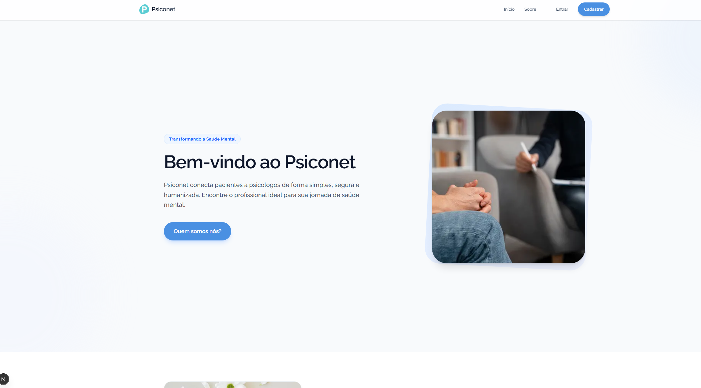
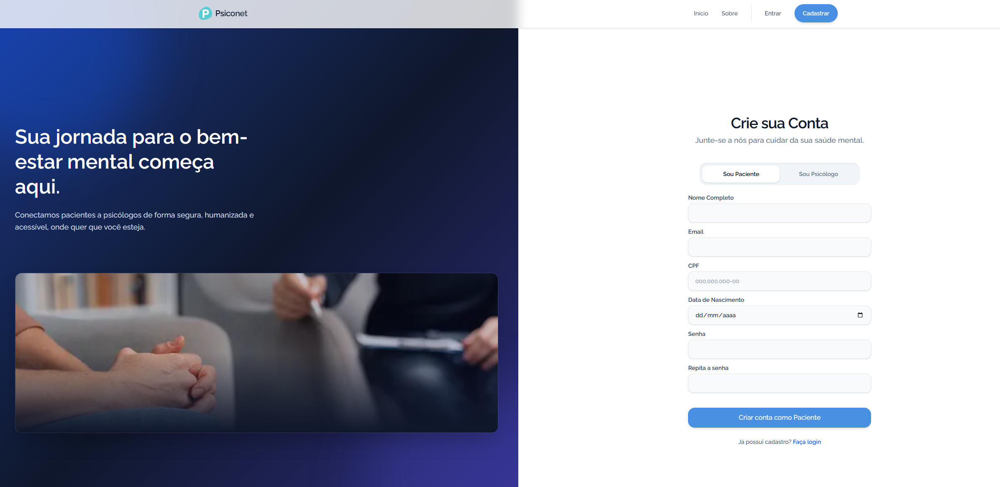
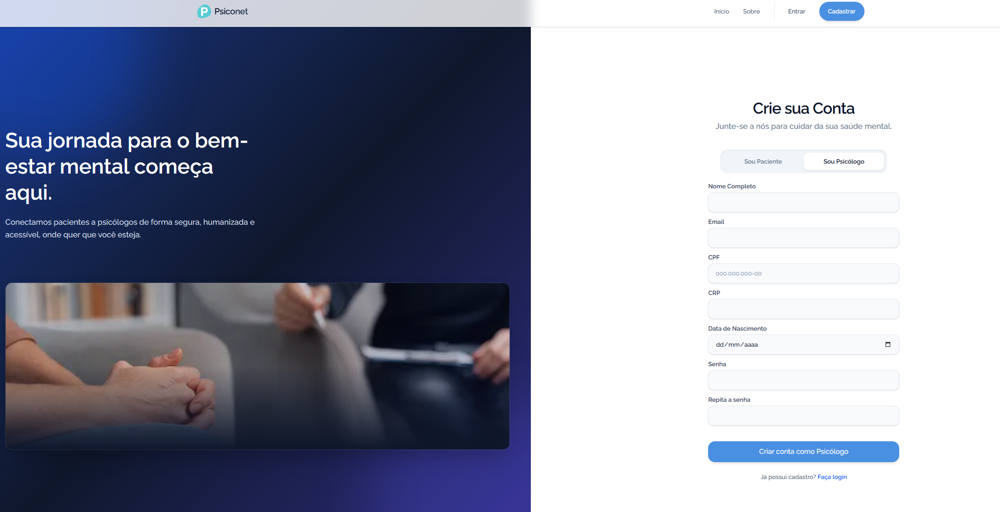
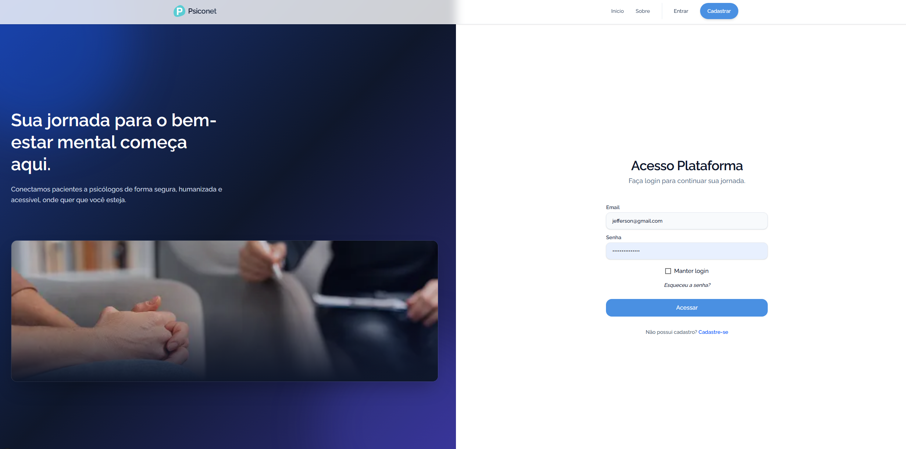
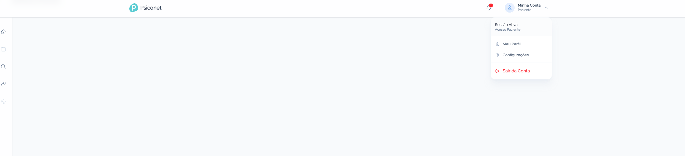
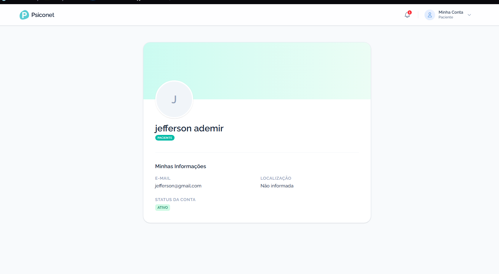
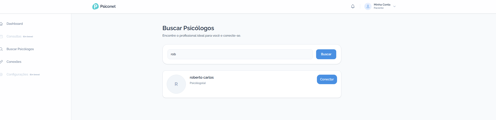
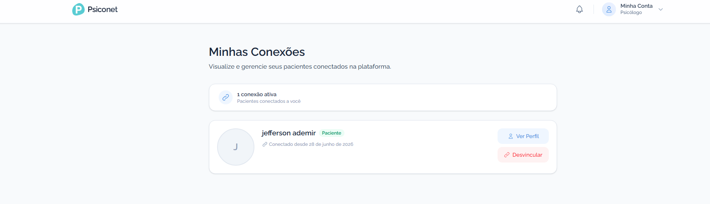
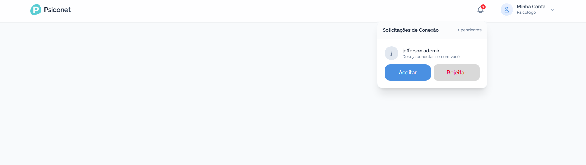

# Projeto Psiconet
**Documentação de Apresentação e Funcionalidades**

---

## 1. Visão Geral do Sistema

### 1.1. O que é o Psiconet?
O **Psiconet** é uma plataforma digital inovadora desenvolvida para atuar como uma ponte entre psicólogos e pacientes. O sistema visa digitalizar e facilitar o dia a dia da clínica, oferecendo ferramentas de gestão, comunicação e organização em um ambiente único e seguro.

### 1.2. A Ideia Inicial e Objetivo
A ideia nasceu da necessidade de modernizar a gestão de profissionais autônomos da psicologia. O objetivo central do projeto é fornecer aos **Psicólogos** uma ferramenta completa (e gratuita) para gerir sua rotina, enquanto oferece aos **Pacientes** um portal simples para encontrar profissionais e manter sua jornada de saúde mental conectada.

---

## 2. Detalhamento das Funcionalidades Atuais (MVP)

A plataforma foi dividida em módulos focados na jornada inicial do usuário. Abaixo estão detalhadas as principais funcionalidades já ativas no sistema, aplicáveis tanto aos pacientes quanto aos profissionais.

### 2.1. Apresentação e Acesso Inicial
A porta de entrada do sistema é uma *Landing Page* (Página Inicial) intuitiva, onde o usuário é introduzido ao propósito do sistema e pode escolher a sua jornada.

* **Landing Page:** Apresenta a plataforma e divide os fluxos entre "Sou Psicólogo" e "Sou Paciente".
* **Cadastro Direcionado:** Formulários específicos para cada público. O psicólogo, por exemplo, deve obrigatoriamente fornecer o seu CRP para validação profissional.

> 
>      
> 

* **Login e Recuperação:** Sistema seguro de autenticação. Caso o usuário esqueça a senha, a plataforma possui uma mecânica automatizada que dispara um e-mail com um link seguro de recuperação.

> 

### 2.2. O seu Painel: Meu Perfil
Após a autenticação, o usuário é direcionado para a área logada, que é guiada por um menu lateral dinâmico (que muda dependendo de quem acessou).

* **Meu Perfil:** Todo usuário possui uma página de perfil, centralizando seus dados cadastrais, e-mail de contato e localização e demonstrando como ele é visto na plataforma.

> 
> 

### 2.3. O Motor de Conexões (Match)
A principal mecânica atual da plataforma é a capacidade de vincular um paciente a um profissional de forma oficial dentro do sistema.

* **Busca Direcionada:** Através do menu lateral, o Paciente pode "Buscar Psicólogos", e o Psicólogo pode "Buscar Pacientes". A ferramenta pesquisa na base de dados e exibe os resultados em formato de cartões.
* **Solicitação de Vínculo:** Com um simples clique no botão "Conectar", um convite é enviado para a outra parte.

> 

* **Aceite e Gerenciamento:** A parte que recebeu o convite pode Aceitar ou Rejeitar. Uma vez aceita, a conexão passa a figurar na aba "Minhas Conexões", onde é possível ver o perfil completo do parceiro ou desvincular o contato a qualquer momento (caso o tratamento seja encerrado).

> 

### 2.4. Sistema de Notificações
Para garantir que nenhuma informação sobre as conexões se perca, o Psiconet conta com alertas integrados à interface:

* **Avisos no Sistema:** O ícone de "Sino" no topo da tela centraliza as notificações em tempo real (como novos pedidos de conexão aguardando sua resposta).

> 

---

## 3. Roadmap e Melhorias Futuras

Como o Psiconet é uma plataforma em evolução contínua, diversas funcionalidades avançadas já foram mapeadas, prototipadas e estão em fase de planejamento para os próximos ciclos de desenvolvimento. São elas:

### 3.1. Dashboards e Painéis de Controle
* **Dashboard do Psicólogo:** Visão macro do trabalho, contendo painéis interativos para "Agendas do Dia", "Agenda Semanal" e um resumo rápido do "Controle Financeiro".
* **Dashboard do Paciente:** Visão simplificada focada em "Agendamentos" futuros e histórico de "Pagamentos".

### 3.2. Gestão de Rotina e Finanças (Módulo do Psicólogo)
Pensando na autonomia total do profissional, o sistema receberá módulos avançados de gestão de clínica:
* **Prontuários e Anotações de Sessão:** O psicólogo terá uma área privada de registros para anotar a evolução clínica do paciente. Essa área será criptografada e estritamente restrita ao profissional.
* **Painel Financeiro:** Módulo para acompanhamento de fluxo de caixa, exibindo quadros de pendências, receitas previstas e despesas.
* **Exportação de Dados (Downloads):** Geração de relatórios detalhados (em formatos `.xlsx`, `.csv` e `.pdf`) para extração de dados contábeis e históricos de atendimento.

### 3.3. Comunicação e Alertas via E-mail
* **Automação de Lembretes:** Expansão da comunicação via SMTP do Java para enviar e-mails automatizados contendo confirmações de consultas, lembretes de sessão e atualizações de agendamento, mantendo psicólogos e pacientes sempre sincronizados fora da plataforma.